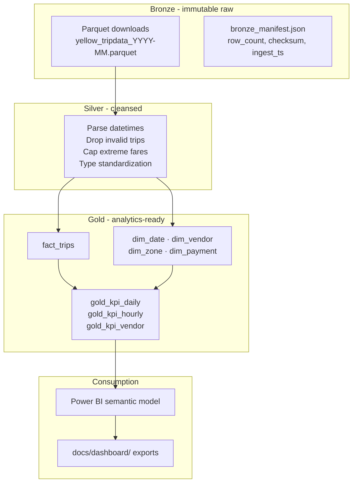

# Medallion Analytics Pipeline

**Status:** Phase 0, EDA gate (scaffold + 1-month bronze data onboarded)  
**Portfolio:** Project 5 of 5 · Balanced DA/DS strategy

A **production-style medallion pipeline** that turns messy raw taxi trip data into **trusted Gold KPIs** and an **executive Power BI dashboard**, with data quality gates, lineage documentation, and BRD-style metric definitions.

[](https://www.python.org/downloads/)
[](./reports/)
[](../README.md)

> **Disclaimer:** This project uses public [NYC TLC Yellow Taxi](https://www.nyc.gov/site/tlc/about/tlc-trip-record-data.page) trip records. It is not employer operational data and does not represent work done for any transit authority or health system.

---

## The business problem

Raw operational extracts land as Parquet or CSV dumps. Executives need dashboards they trust. Hiring managers in **Vancouver** (and enterprise teams in Seattle) ask:

> *Can you own Bronze → Silver → Gold, write the SQL, document KPIs, enforce quality rules, and deliver a dashboard with lineage?*

This project is **pipeline-first, ML-optional**. The goal is trusted analytics infrastructure, not forcing predictive modeling onto weak signal (lesson from the DataCo supply chain sibling repo).

---

## Who this is for (hiring signal)

| Market | Why this repo matters |
|--------|----------------------|
| **Vancouver (primary)** | DA/BI roles explicitly ask for Databricks/Delta Gold + Power BI + complex SQL |
| **Seattle enterprise** | Pipeline ownership, data quality, executive storytelling |
| **Your cert stack** | Ties to **PL-900** (Power BI) and **AZ-900** (Azure mapping doc, no separate Azure-only repo) |

**Databricks note:** Deep Databricks work lives in the **UBC Seaspan capstone**. This repo is a **local-first TLC pipeline** with an optional Databricks mirror later, not a second capstone.

**Complements:** ML-heavy repos (supply chain, stock, healthcare) and product experimentation (SQL + stats).

---

## What you will get when complete (v1 target)

| Layer | Deliverable | Evidence |
|-------|-------------|----------|
| **Bronze** | Immutable raw Parquet + ingest manifest | `data/bronze/yellow/` + `bronze_manifest.json` |
| **Silver** | Cleansed, typed, deduped trips | Documented drop rules in `docs/DATA_QUALITY_RULES.md` |
| **Gold** | Star schema SQL views | `fact_trips` + `dim_date`, `dim_vendor`, `dim_zone`, `dim_payment` |
| **Quality** | pytest data tests on fixtures | `tests/test_data_quality.py` |
| **KPIs** | BRD-style definitions | `docs/KPI_DEFINITIONS.md`, no drift vs Power BI DAX |
| **Lineage** | Mermaid diagram + refresh story | `docs/lineage.md` |
| **BI** | Power BI `.pbix` + PDF export | `powerbi/` + `docs/dashboard/` screenshots |
| **Orchestration** | GitHub Actions on sample/subset | `.github/workflows/refresh.yml` |

---

## Dataset: NYC TLC Yellow Taxi

**Source:** [NYC TLC Trip Record Data](https://www.nyc.gov/site/tlc/about/tlc-trip-record-data.page)  
**Dictionary:** [Yellow trip data dictionary (PDF)](https://www.nyc.gov/assets/tlc/downloads/pdf/data_dictionary_trip_records_yellow.pdf)

| Property | Value |
|----------|-------|
| **On disk now** | `data/bronze/yellow/yellow_tripdata_2026-01.parquet` (~61 MB) |
| **Sprint scope** | 1 month for EDA; optional Feb–Mar for 3-month Gold KPIs |
| **Format** | Parquet preferred over CSV |
| **Git policy** | `data/bronze/`, `data/silver/`, `data/gold/` gitignored except `.gitkeep` and test fixtures |

### Why TLC (not DataCo again)

| Criterion | TLC |
|-----------|-----|
| **Volume** | Millions of rows/month, credible scale |
| **Messiness** | Nulls, bad fares, invalid timestamps, real pipeline work |
| **Modeling** | Natural star schema: trips fact + date + zone + vendor |
| **KPI clarity** | Trips/day, revenue, avg fare, peak hour, payment mix |
| **Access** | Public, free, no API keys |

### Key columns (verify in EDA)

| Column | Use |
|--------|-----|
| `VendorID` | `dim_vendor` |
| `tpep_pickup_datetime`, `tpep_dropoff_datetime` | `dim_date`, duration validation |
| `passenger_count`, `trip_distance` | Fact measures |
| `PULocationID`, `DOLocationID` | `dim_zone` (taxi zone lookup optional v1) |
| `payment_type` | `dim_payment` |
| `fare_amount`, `tip_amount`, `total_amount` | Revenue KPIs |
| `congestion_surcharge`, `cbd_congestion_fee` | 2024+ fee columns |

---

## Medallion architecture (target)



### Layer rules

| Layer | Rule |
|-------|------|
| **Bronze** | Never overwrite raw files; new ingest = new partition |
| **Silver** | All drops logged with counts; thresholds in `DATA_QUALITY_RULES.md` |
| **Gold** | SQL views or Parquet star schema; KPI definitions locked in BRD doc |
| **BI** | DAX measures mirror `KPI_DEFINITIONS.md` exactly |

### Draft data quality rules (confirm in EDA)

| Rule | Silver action |
|------|---------------|
| `total_amount` null | Drop row; log count |
| `total_amount` < 0 | Drop or flag |
| `trip_distance` ≤ 0 | Drop |
| Pickup after dropoff | Drop |
| Duplicate exact trip fingerprint | Investigate; dedup if true duplicate |

---

## Planned Gold KPIs (draft, lock after EDA)

| KPI | Draft definition |
|-----|------------------|
| **Daily trip volume** | `count(*)` by pickup date |
| **Total revenue** | `sum(total_amount)` by day |
| **Average fare** | `avg(fare_amount)` by day |
| **Peak hour** | Trips by hour-of-day |
| **Payment mix** | % by `payment_type` |
| **Avg trip distance** | `avg(trip_distance)` by day |

Locked definitions go in `docs/KPI_DEFINITIONS.md` (enterprise BRD language).

---

## Target repository layout (post-EDA)

```
medallion-analytics-pipeline/
├── pipeline/
│   ├── bronze_ingest.py
│   ├── silver_transform.py
│   ├── gold_build.py
│   └── run_pipeline.py        # CLI: make pipeline
├── sql/gold/                  # CREATE VIEW statements
├── tests/
│   ├── fixtures/              # tiny parquet samples
│   └── test_data_quality.py
├── powerbi/
│   └── medallion_dashboard.pbix
├── docs/
│   ├── KPI_DEFINITIONS.md
│   ├── DATA_QUALITY_RULES.md
│   ├── lineage.md
│   ├── AZURE_EQUIVALENT.md    # ADF/Synapse mapping (AZ-900)
│   └── dashboard/             # PDF/png for GitHub
├── notebooks/00_eda_gate.ipynb
└── reports/eda_gate.md
```

**Transform engine:** Polars or DuckDB (pick one during EDA; Polars preferred for large Parquet ingest).

**Optional ML (only if pipeline done early):** Isolation Forest on daily trip-count anomalies, one notebook max; does not block v1.

---

## Phase 0: current focus (START HERE)

Pipeline code does not start until the EDA gate passes.

| Deliverable | Status |
|-------------|--------|
| `notebooks/00_eda_gate.ipynb` | ⏳ Pending |
| `reports/eda_gate.md` (GO/NO-GO) | ⏳ Pending |
| `docs/DATA_DICTIONARY.md` | ⏳ Pending |
| `docs/KPI_DEFINITIONS.md` (draft) | ⏳ Pending |

### EDA gate checks

- Load Jan 2026 Parquet; row count and memory estimate for 3 months
- Null % on `total_amount`, `trip_distance`, `passenger_count`
- Outlier distributions, propose fare/distance caps
- Invalid datetime rows (pickup after dropoff)
- Daily trip volume time series, sanity check
- Draft star schema Mermaid in `docs/lineage.md`

**Pass criteria:** ≥500k rows (1 month) or ≥1M (3 months) · <10% row loss in Silver with documented rules · KPI list passes review.

Full checklist: [`../PORTFOLIO_EDA_SPRINT.md`](../PORTFOLIO_EDA_SPRINT.md)

### Download (if data missing)

```text
# From NYC TLC site, Parquet preferred
data/bronze/yellow/yellow_tripdata_2026-01.parquet   # ✅ on disk
data/bronze/yellow/yellow_tripdata_2026-02.parquet   # optional
data/bronze/yellow/yellow_tripdata_2026-03.parquet   # optional
```

---

## How this differs from sibling repos

| Repo | Focus |
|------|-------|
| `risk-prediction` | ML classification + SHAP; not lakehouse layers |
| `product-experimentation` | A/B testing + metric SQL; not medallion cleansing |
| `healthcare-noshow-predictor` | Regulated ML ops; not executive BI |
| `research-instrument` | Falsification + time series; not batch ETL |

---

## Cloud & tools (locked portfolio decisions)

| Tool | Role in this repo |
|------|-------------------|
| **Local pipeline** | Primary, must run without cloud |
| **Power BI** | P0 deliverable (PL-900 alignment) |
| **GitHub Actions** | Orchestration narrative (no Airflow repo) |
| **Databricks Delta** | Optional mirror after local E2E; Seaspan is primary |
| **AWS S3** | Optional bronze backup + dashboard PDF archive |
| **Snowflake / Airflow** | Explicitly skipped |

Details: [`../PORTFOLIO_TOOLS_PLAYBOOK.md`](../PORTFOLIO_TOOLS_PLAYBOOK.md)

---

## Developer entry points

1. [`CONTEXT.md`](./CONTEXT.md): mission, layer specs, session playbook
2. [`../PORTFOLIO_EDA_SPRINT.md`](../PORTFOLIO_EDA_SPRINT.md): EDA checklist
3. [`CLAUDE.md`](./CLAUDE.md): rules and commands
4. [`docs/FUTURE_ENHANCEMENTS.md`](./docs/FUTURE_ENHANCEMENTS.md): E2E checklist

### Quick setup (when implementation starts)

```bash
cd medallion-analytics-pipeline
pip install -e ".[dev]"
pre-commit install
make pipeline   # after pipeline/ exists
make test
```

---

## Resume bullet (fill after v1, no invented numbers)

> Built medallion pipeline (Bronze/Silver/Gold) on N NYC taxi trips with automated quality tests; authored KPI definitions and Power BI executive dashboard with documented lineage.

---

## Author

**Tirth Joshi**, UBC Master of Data Science · Former analytics (VGH, BCCNM, Walmart Canada) · PL-900, AZ-900

Do **not** claim TLC pipeline work as employer project.

---

## License

MIT License. See [`LICENSE`](LICENSE) when added.
