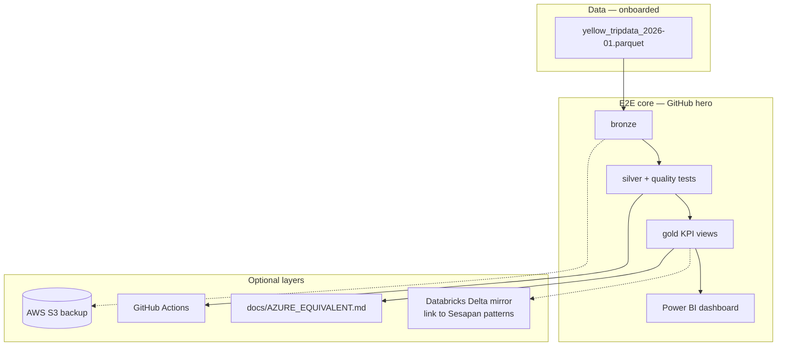

# Future Enhancements — Medallion Analytics Pipeline

**Repo:** `medallion-analytics-pipeline`  
**Updated:** 2026-05-30  
**Portfolio reference:** [`../PORTFOLIO_TOOLS_PLAYBOOK.md`](../PORTFOLIO_TOOLS_PLAYBOOK.md) · Project 5 diagram

**Dataset:** `data/bronze/yellow/yellow_tripdata_2026-01.parquet` (~61 MB)

**Databricks note:** Primary Databricks depth lives in **Sesapan capstone**. This repo adds a **public TLC pipeline** + optional Databricks mirror — **not a second capstone**.

---

## E2E definition (complete story)

Done when:

- [ ] `reports/eda_gate.md` — GO
- [ ] Local Bronze → Silver → Gold pipeline + pytest quality tests
- [ ] `docs/KPI_DEFINITIONS.md` + `docs/lineage.md`
- [ ] Power BI `.pbix` + PDF export in `docs/dashboard/`
- [ ] README with run instructions + architecture diagram

---

## Apply-ready enhancements

| Priority | Enhancement | Tool | Employer signal |
|----------|-------------|------|-----------------|
| P0 | EDA gate on 2026-01 Parquet | Polars/DuckDB | Messy real data |
| P0 | Silver cleansing rules + row-drop counts | Python + docs | Data quality |
| P0 | Gold star schema + 5+ KPIs | SQL views | Vancouver DA / BI |
| P0 | Power BI dashboard | Power BI (PL-900) | Executive storytelling |
| P1 | GitHub Actions refresh on sample | GitHub Actions | Orchestration |
| P1 | `docs/AZURE_EQUIVALENT.md` (ADLS/ADF/Synapse mapping) | Markdown | AZ-900 alignment |

---

## Optional layers (after local E2E)

| Priority | Enhancement | Tool | Notes |
|----------|-------------|------|-------|
| P2 | Databricks Delta mirror (1–2 notebooks) | Databricks | Same patterns as Sesapan; TLC data only |
| P2 | S3 bronze backup + dashboard PDF | AWS S3 | `scripts/sync_bronze_to_s3.py` |
| P3 | dbt-core models for Silver→Gold | dbt | Optional transform-as-code |
| — | Snowflake trial | — | **Reject** — redundant with Databricks |
| — | Airflow cluster | — | **Reject** — use GitHub Actions |
| — | EC2 | — | **Reject** |

---

## Explicitly rejected

| Item | Why |
|------|-----|
| DataCo supply chain as bronze | Weak narrative; project 1 already uses it |
| Full 3-month TLC before E2E | Start 1 month; expand after Gold works |
| Second Databricks capstone scope | Sesapan is the deep home |

---

## Architecture target



---

## Interview lines

- **DA/BI JD:** “I built medallion Bronze/Silver/Gold on NYC taxi data with KPI definitions, quality tests, and Power BI.”
- **Databricks JD:** “Deep Databricks work is my Sesapan capstone; this public repo shows the same medallion pattern on mobility data.”
- **Azure JD:** “I document ADF/Synapse equivalents; I have AZ-900 and Power BI from regulated-sector work.”

---

## Claude Code prompt

```text
Read docs/FUTURE_ENHANCEMENTS.md and CONTEXT.md. Phase 0 EDA then local pipeline E2E.
Power BI + KPI_DEFINITIONS.md required. Databricks notebooks optional after local Gold works.
Add AZURE_EQUIVALENT.md. Optional S3 sync script. No Airflow, no Snowflake.
```
